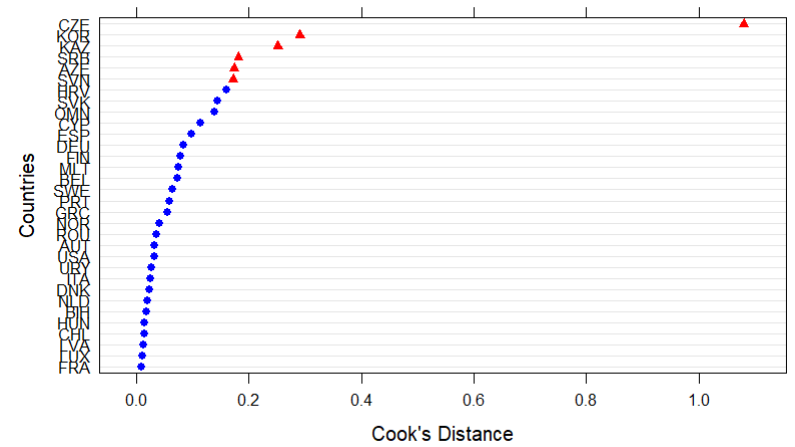
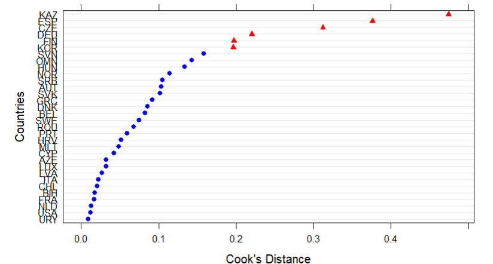
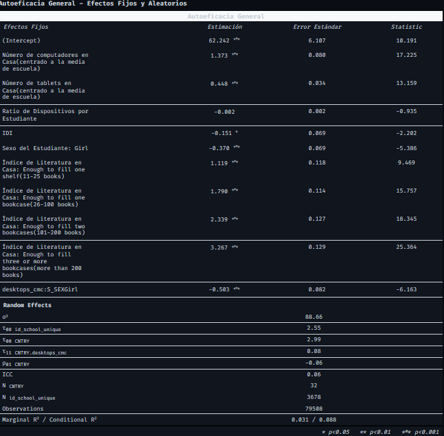
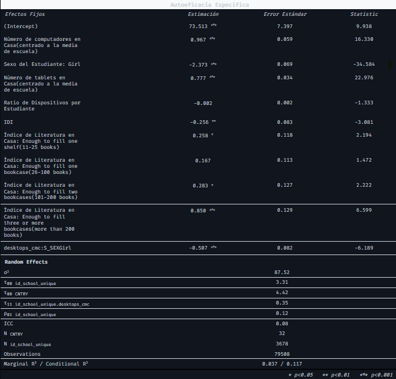

---
format:
  revealjs:
    title-slide: false
    theme: multinivel.scss
    incremental: true 
    slideNumber: true
    auto-stretch: false
    transition: fade
    transition-speed: slow
editor: source
---

```{r}
pacman::p_load(dplyr, haven, lme4, summarytools, tidyverse, sjPlot, corrplot, reghelper, corrplot, psych, table1, ggplot2, car)


options(scipen = 999) 
rm(list = ls())   

mlm = readRDS("output/datos_proc.rds")
df_idi = readRDS("output/datos_descr_idi.rds")

mlm = mlm %>% 
  as.data.frame()


#results_0 = lmer(mathach ~ 1 + (1 | schoolid), data = mlm)
#results_1 = lmer(mathach ~ 1 + ses + female + (1 | schoolid), data = mlm)
#results_2 = lmer(mathach ~ 1 + sector + mnses + (1 | schoolid), data = mlm)
#results_3 = lmer(mathach ~ 1 + ses + female + sector + mnses + (1 | schoolid), data = mlm)
#results_4 = lmer(mathach ~ 1 + ses + female + sector + mnses + ses*sector + (1 | schoolid), data = mlm)
```

:::::: columns
::: {.column width="20%"}
<br>
:::

:::: {.column .column-right width="80%"}
# **¿Mayor acceso significa mayor autoeficacia?**

------------------------------------------------------------------------

**Ismael Aguayo, Domingo Monasterio, Exequiel Trujillo & Antonia Vera**

::: {.red2 .medium}
**Análisis de Datos Multinivel - 2025**

**Departamento de Sociología, Universidad de Chile**
:::

Santiago, 19 de Junio de 2025<br> [🐱github.com/multinivel-facso/trabajo1-grupo-2](https://github.com/multinivel-facso/trabajo1-grupo-2)
::::
::::::

::: notes
Aquí mis notas
:::

# Introducción

-   **Problema de estudio:** Efecto del acceso TIC en el hogar, en la escuela y en el país en la autoeficacia digital de estudiantes.

-   **Factores asociados \[L1\]:** Acceso de estudiantes a TIC en el hogar, alfabetización en el hogar y género.

-   **Factores asociados \[L2\]:** Acceso de estudiantes a TIC en la escuela.

-   **Factores asociados \[L3\]:** Índice de Desarrollo de TIC (IDI) en el país.

# ¿De qué manera el acceso a TIC en el hogar y en la escuela influye en la autoeficacia digital general y especializada de los estudiantes? ¿y cómo influye el índice de desarrollo de TIC del país? {.center-v}

# Hipótesis:

-   $H_1$\[L1\]: El acceso a TIC en el hogar tendrá un efecto positivo en la autoeficacia digital de los estudiantes.

-   $H_2$\[L2\]: El ratio \[dispositivos TIC disponibles por estudiante\]/\[cantidad de estudiantes\] tendrá un efecto positivo en la autoeficacia digital de los estudiantes.

-   $H_3$\[L3\]: Los estudiantes de países con mayor IDI (Índice de Desarrollo de TIC) presentarán niveles más altos de autoeficacia digital.

-   $H_4$\[L3\]: El efecto del acceso a computadores en el hogas sobre la autoeficacia de los estudiantes es moderado por el sexo.

# Metodología

-   Método Multinivel

-   Centrado de variables y tratamiento de casos influyentes

-   Modelo nulo, modelo con intercepto aleatorio y modelo con intercepto y pendiente aleatorias

# Datos (ICILS 2023)

::: panel-tabset
### Características Personales

```{r}
label(mlm$S_GENEFF)  <- "Autoeficacia General"
label(mlm$S_SPECEFF) <- "Autoeficacia Específica"
label(mlm$S_SEX)     <- "Sexo del Estudiante"
label(mlm$S_INTNET)  <- "Acceso a Internet en Casa"

table1(~ S_GENEFF + S_SPECEFF + S_SEX + S_INTNET, 
       data = mlm,
       caption = "<h3>Características Personales del Estudiante</h3>",
       footnote = "Los datos continuos se presentan como Media (Desviación Estándar)")
```

### Recursos del Hogar

```{r}
label(mlm$S_HOMLIT)  <- "Índice de Literatura en Casa"
label(mlm$desktops_cmc)  <- "Número de computadores en Casa (centrado a la media de escuela)"
label(mlm$tablets_cmc)  <- "Número de tablets en Casa (centrado a la media de escuela)"

table1(~ S_HOMLIT + desktops_cmc + tablets_cmc, 
       data = mlm,
       caption = "<h3>Recursos Tecnológicos y Educativos</h3>",
       footnote = "Nota: Elaborado con datos de ICILS 2023.")
```

### Variables por Escuela

```{r}

label(mlm$C_RATDEV)  <- "Ratio de Dispositivos por Escuela"
label(mlm$C_RATSTD)  <- "Ratio de Dispositivos por Estudiante"

table1(~ C_RATDEV + C_RATSTD, 
       data = mlm,
       caption = "<h3>Características de la Muestra de Escuelas</h3>",
       footnote = "Los datos continuos se presentan como Media (Desviación Estándar).
       <br>Nota: Elaborado con datos de ICILS 2023.")

```

### IDI

```{r}
label(df_idi$IDI)  <- "ICT Development Index (IDI)"


tabla3_idi <- table1(~ IDI, 
                           data = df_idi,
                           caption = "<h3>Estadísticos Descriptivos de ICT Development Index (IDI)</h3>",
                           footnote = "Los datos se presentan como Media (Desviación Estándar).
                           <br>Nota: Elaborado con datos de IDI 2023.")

tabla3_idi
```
:::

# Variables

-   Variables dependientes: Autoeficacia (general y específica)

-   Variables nivel 1: Disponibilidad de aparatos TIC en el hogar: computadores, tablets y smartphones; Índice de literatura del hogar; Sexo de estudiantes; Acceso a internet.

-   Variables nivel 2: Ratio de aparatos TIC disponibles por estudiante: computadores y tablets; Reporte de coordinadores TIC sobre disponibilidad de recursos TIC en escuela.

-   Variables nivel 3: IDI

# Modelos Multinivel de Autoeficacia

## Modelo 1: Autoeficacia General

::::: columns
::: {.column width="55%"}
$$
\begin{align}
S\_GENEFF_{ijk} &= \delta_{000} + \delta_{100} \cdot desktops\_cmc_{ijk} + \beta_2 \cdot tablets\_cmc_{ijk} \\
&\quad + \beta_3 \cdot C\_RATSTD_{jk} + \beta_4 \cdot IDI_{k} \\
&\quad + \beta_5 \cdot (desktops\_cmc_{ijk} \times S\_SEX_{ijk}) \\
&\quad + \beta_6 \cdot S\_HOMLIT_{ijk} + \beta_7 \cdot S\_SEX_{ijk} \\
&\quad + v_{00k} + v_{10k} \cdot desktops\_cmc_{ijk} + u_{0jk} + e_{ijk}
\end{align}
$$
:::

::: {.column width="30%" style="padding-left: 10px;"}
**Índices:**

$i$ = estudiante\
$j$ = escuela\
$k$ = país

**Coeficientes:**

$\beta$ = efectos fijos (estudiante)\
$\gamma$ = efectos escuela\
$\delta$ = efectos país

**Efectos Aleatorios:**

$e_{ijk} \sim N(0, \sigma_e^2)$\
$u_{0jk} \sim N(0, \sigma_u^2)$\
$(v_{00k}, v_{10k})' \sim MVN(0, \mathbf{T}_v)$

donde $\mathbf{T}_v = \begin{pmatrix} \tau_{00} & \tau_{01} \\ \tau_{01} & \tau_{11} \end{pmatrix}$
:::
:::::

## Modelo 2: Autoeficacia Específica

::::: columns
::: {.column width="60%"}
$$
\begin{align}
S\_SPECEFF_{ijk} &= \delta_{000} + \delta_{100} \cdot desktops\_cmc_{ijk} + \beta_2 \cdot tablets\_cmc_{ijk} \\
&\quad + \beta_3 \cdot C\_RATSTD_{jk} + \beta_4 \cdot IDI_{k} \\
&\quad + \beta_5 \cdot (desktops\_cmc_{ijk} \times S\_SEX_{ijk}) \\
&\quad + \beta_6 \cdot S\_HOMLIT_{ijk} + \beta_7 \cdot S\_SEX_{ijk} \\
&\quad + v_{00k} + u_{0jk} + u_{1jk} \cdot desktops\_cmc_{ijk} + e_{ijk}
\end{align}
$$
:::

::: {.column width="30%" style="padding-left: 10px;"}
**Índices:**

$i$ = estudiante\
$j$ = escuela\
$k$ = país

**Efectos Aleatorios:**

$e_{ijk} \sim N(0, \sigma_e^2)$\
$v_{00k} \sim N(0, \tau_{00})$\
$(u_{0jk}, u_{1jk})' \sim MVN(0, \mathbf{T}_u)$

donde $\mathbf{T}_u = \begin{pmatrix} \sigma_{u00} & \sigma_{u01} \\ \sigma_{u01} & \sigma_{u11} \end{pmatrix}$
:::
:::::

# Resultados

# Resultados descriptivos

::: panel-tabset
## AEG/AEE

```{r}
library(ggplot2)

ggplot(mlm, aes(x = S_SPECEFF, y = S_GENEFF)) +
  geom_point(alpha = 0.1, color = "steelblue") +
  geom_smooth(method = "lm", color = "red", se = FALSE) +
  labs(
    title = "Relación entre Autoeficacia General y Específica",
    subtitle = "Datos limpios, con línea de regresión lineal",
    x = "Puntaje de Autoeficacia Específica",
    y = "Puntaje de Autoeficacia General"
  ) +
  theme_minimal()
```

## AEG/RDEscuela

```{r}

ggplot(mlm, aes(x = C_RATSTD, y = S_GENEFF)) +
  geom_point(alpha = 0.1, color = "darkgray") +
  geom_smooth(method = "lm", color = "darkorange", se = FALSE) +
  labs(
    title = "Relación entre Autoeficacia General y Ratio de Dispositivos por Escuela",
    subtitle = "Cada punto representa a un estudiante",
    y = "Ratio de Dispositivos por Escuela",
    x = "Puntaje de Autoeficacia General del Estudiante"

  ) +
  theme_minimal()
```

## AEE/RDEscuela

```{r}
ggplot(mlm, aes(x = C_RATSTD, y = S_SPECEFF)) +
  geom_point(alpha = 0.1, color = "darkgray") +
  geom_smooth(method = "lm", color = "darkorange", se = FALSE) +
  labs(
    title = "Relación entre Autoeficacia Específica y Ratio de Dispositivos por Escuela",
    subtitle = "Cada punto representa a un estudiante",
    x = "Ratio de Dispositivos por Escuela",
    y = "Puntaje de Autoeficacia Específica del Estudiante"

  ) +
  theme_minimal()
```

## PCs/AEG

```{r}
ggplot(mlm, aes(x = IS3G16AA, y = S_GENEFF)) +
  geom_boxplot() +
  labs(title = "Autoeficacia General según la cantidad de PCs en casa",
       x = "Cantidad de PCs en casa)",
       y = "Autoeficacia General")
```

## Tablets/AEG

```{r}
ggplot(mlm, aes(x = IS3G16AB, y = S_GENEFF)) +
  geom_boxplot() +
  labs(title = "Autoeficacia General según la cantidad de Tablets en casa",
       x = "Cantidad de Tablets en casa",
       y = "Autoeficacia General")
```
:::

# Casos influyentes por País

::: panel-tabset
## General

```{r}
#| include: false
# Cargar datos sin mostrar
estex_gen_cnt <- readRDS("./output/estex_gen_cnt.rds")
```

{fig-align="center" width="85%"}

## Específica

```{r}
#| include: false
# Cargar datos sin mostrar
estex_spec_cnt <- readRDS("./output/estex_spec_cnt.rds")
```

{fig-align="center" width="85%"}
:::

------------------------------------------------------------------------

## Coeficientes de Correlación Intraclase (ICC)

```{r}
#| echo: false
#| results: asis

# Calcular ICC
ICC_schl_gen <- 2.909/(2.909 + 91.049)
ICC_cnt_gen <- 3.327/(3.327 + 2.909 + 91.049)
ICC_schl_spec <- 3.212/(3.212 + 90.530)
ICC_cnt_spec  <- 5.400/(5.400 + 3.212 + 90.530)

# Crear tabla de resultados
library(kableExtra)
library(dplyr)

icc_results <- data.frame(
  Modelo = c("Autoeficacia General", "Autoeficacia General", 
             "Autoeficacia Específica", "Autoeficacia Específica"),
  Nivel = c("Escuela", "País", "Escuela", "País"),
  ICC = c(ICC_schl_gen, ICC_cnt_gen, ICC_schl_spec, ICC_cnt_spec),
  Porcentaje = paste0(round(c(ICC_schl_gen, ICC_cnt_gen, ICC_schl_spec, ICC_cnt_spec) * 100, 2), "%")
)

kable(icc_results, 
      col.names = c("Modelo", "Nivel", "ICC", "Porcentaje"),
      digits = 4,
      align = "lccc") %>%
  kable_styling(bootstrap_options = c("striped", "hover", "condensed"),
                full_width = FALSE,
                position = "center",
                font_size = 16) %>%
  row_spec(0, bold = TRUE, background = "#f8f9fa") %>%
  column_spec(1, bold = TRUE, width = "3cm") %>%
  column_spec(2, width = "2cm") %>%
  column_spec(3:4, width = "2cm")
```

------------------------------------------------------------------------

```{r}
#| label: tbl-modelo-general
#| tbl-cap: "Modelo de Autoeficacia General con Efectos Aleatorios"

# --- Modelo 3: Autoeficacia GENERAL con Intercepto y Pendiente Aleatorios ---
modelo_gen_pendiente <- lmer(S_GENEFF ~ desktops_cmc + tablets_cmc + C_RATSTD + IDI +       
                           desktops_cmc*S_SEX + S_HOMLIT + S_SEX + 
                           (1 + desktops_cmc | CNTRY) + (1 | id_school_unique), 
                           data = mlm, 
                           control = lmerControl(optimizer = "bobyqa"))

```

{fig-align="center"}

------------------------------------------------------------------------

```{r}
#| label: tbl-modelo-especifica
#| tbl-cap: "Modelo de Autoeficacia Específica con Efectos Aleatorios"

# --- Modelo 4: Autoeficacia ESPECÍFICA con Intercepto y Pendiente Aleatorios ---
modelo_spec_pendiente <- lmer(S_SPECEFF ~ desktops_cmc*S_SEX + tablets_cmc + C_RATSTD + IDI + 
                            tablets_cmc + S_HOMLIT + S_SEX + 
                            (1 | CNTRY) + (1 + desktops_cmc | id_school_unique), 
                            data = mlm, 
                            control = lmerControl(optimizer = "bobyqa"))

```

## {fig-align="center"}

## Interacción

:::: columns
::: {.column width="70%"}
```{r}

sjPlot::plot_model(modelo_spec_pendiente, type="int")

```
:::
::::

# Conclusiones {data-background-color="black"}

::: incremental
-   $H_1$\[L1\]: El acceso si aumenta la autoeficacia
-   $H_2$\[L2\]: El ratio demostró no ser significativo
-   $H_3$\[L3\]: Efecto contrario del IDI
-   $H_4$\[L3\]: Los chicos son más afectados por el acceso en el hogar
-   Efecto de computadores \> efecto tablets... calidad de acceso?
-   Países con + IDI ≠ países con + autoeficacia
-   La insignificancia de la escuela
:::

## Referencias

-   ::: {style="margin-left: 0.5in;  text-indent: -0.5in;"}
    Bandura, A. (Ed.). (1995). Self-efficacy in changing societies. Cambridge University Press. https://doi.org/10.1017/CBO9780511527692 
    :::

-   ::: {style="margin-left: 0.5in;  text-indent: -0.5in;"}
    Eastin, M. S., & LaRose, R. (2000). Internet self-efficacy and the psychology of the digital divide. Journal of Computer-Mediated Communication, 6(1). <https://doi.org/10.1111/j.1083-6101.2000.tb00110.x> 
    :::

-   ::: {style="margin-left: 0.5in;  text-indent: -0.5in;"}
    Hatlevik, O. E., Gudmundsdottir, G. B., & Loi, M. (2018). Digital diversity among upper secondary students: A multilevel analysis of the relationship between socio-economic status and digital competence. Computers & Education, 120, 91--102. <https://doi.org/10.1016/j.compedu.2014.10.019> 
    :::

    -   ::: {style="margin-left: 0.5in;  text-indent: -0.5in;"}
        Ulfert-Blank, A. S., & Schmidt, I. (2022). Assessing digital self-efficacy: Review and scale development. Computers & Education, 191, 104626. <https://doi.org/10.1016/j.compedu.2022.104626> 
        :::
